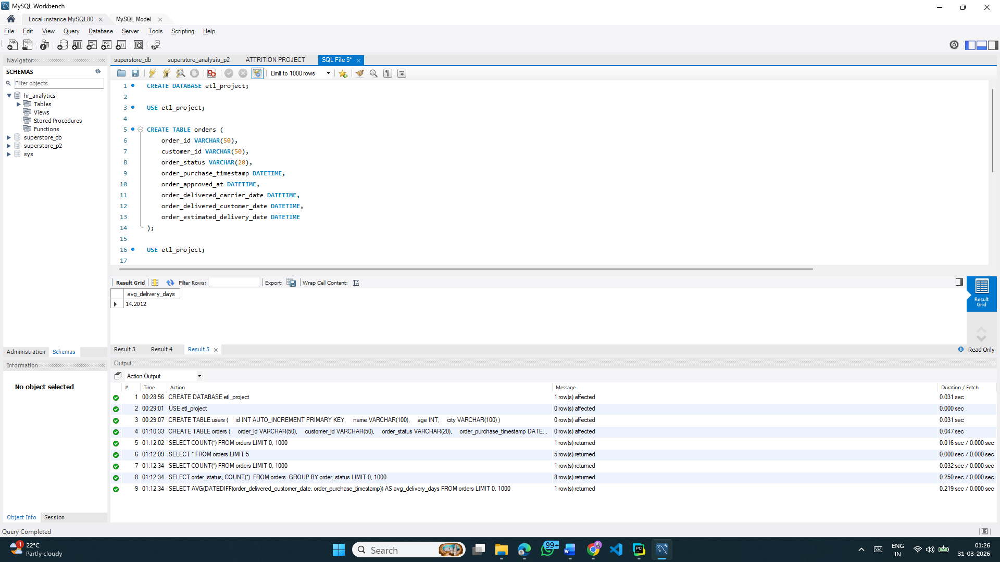

# 🚀 ETL Data Pipeline (CSV → MySQL)

## 📌 Overview
This project implements an end-to-end ETL (Extract, Transform, Load) pipeline using Python and MySQL to process real-world e-commerce order data.

## ⚙️ Tech Stack
- Python (Pandas)
- MySQL
- Git

## 🔄 Pipeline Workflow
1. Extract data from CSV file
2. Transform data (cleaning, handling missing values, datetime conversion)
3. Load data into MySQL database

## 📂 Project Structure

scripts/
extract.py
transform.py
load.py
main.py
data/
raw_data.csv
cleaned_data.csv
sql/
schema.sql
queries.sql


## ▶️ How to Run
```bash
pip install -r requirements.txt
python scripts/main.py

## 📸 Output
